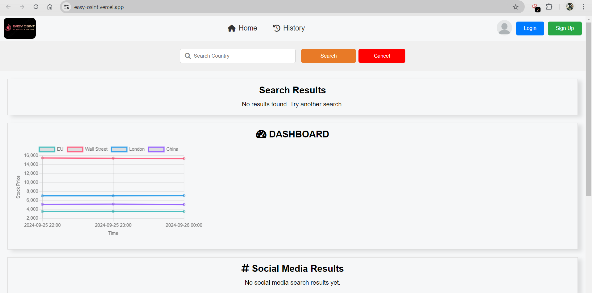

<h1>easyOSINT</h1>

 
<h2>Description</h2>

OSINT (Open Source Intelligence) is widely used in various fields, including cybersecurity, law
enforcement, corporate security, military operations, and journalism. The goal
is to gather information that can help in decision-making, threat assessment,
and strategic planning. This information can come from a wide variety of sources, including:
 
1. Online Publications and Media 
2. Social Media 
3. Public Databases and Government Reports 
4. Internet Forums and Communities 
5. Corporate Websites, etc… 

<h2>How it Works?</h2>
<h3>Step 1:</h3>
<h4>Test Locally</h4>

Run the following command in your terminal:

>git clone <repository_name.git> 
>cd <repository_name> 
>python3 wsgi.py

 

You will see:

>click on <http://localhost:5000>

 

<h3>Step 2:</h3>
<ol>
    <li>Enter a search query</li>
    <li>click search to see results</li>
    <li>To search for a social media account:</li>
    <ul>
        <li>click on filter and choose <strong>Person</strong></li>
        
        <li>Enter the username</li>
        
        <li>click search</li>
    </ul>
    <li>To Search for country</li>
    <ul>
        <li>click on filter and choose <strong>Country</strong></li>
        
        <li>Enter the country name in the search bar</li>
        
        <li>click search</li>
    </ul>
</ol>
 
<h3>Step 3:</h3>
<h5>Test online on:</h5>
<a href="https://easy-osint.vercel.app/" target="blank">easyOSINT</a>